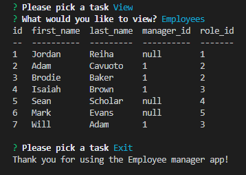
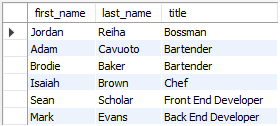

## EMPLOYEE DATABASE MANAGER

# Description
This is an application that allows an Employer to add and moniter their employees and company structure via SQL Database, The employer can add dpecific department categories and create specific job roles that will fit into those categories. (E,G, Department: "IT" which has the subroles of Front-end Developer and Back-end Developer) The employer can also add Employees to the database and at any point in time they can edit that employee's role, (EG Change "John Doe" from a Front-end Developer to a Back-end Developer).
 

[Here is a Link to the project code!](https://github.com/Alex-Waite/EmployeeManager)
 

[Here is a Link to a video of the project!](https://drive.google.com/file/d/1xdmANiJjsBjzl2T_MRxhcCoUCisMnTJ_/view?usp=sharing)
 

# Technology Used
The main technology used in this project includes, the Inquirer module for determining and using user input and mySQL for database management and manipulation.

# Instructions
The user must first type _npm install_ into their console to get all required modules and dependencies
The user may from there on use the program as they desire however remember when asked for an ID an integer is expected not a string

# Bugs I am aware of/Planned features
When editing a role currently the user must refer to the roles specific ID, I would like the inquirer to return a list of choices with the role titles displayed but with a underlying value of the roles ID

When viewing employees the employee role ID is returned rather than the role title so the user has to view what role the ID corelates to, I would change this to use an inner join to connect the Employee's role_id foreign key to conect the values, I was able to get this to work in SQL however am unsure why it wouldnt work in the actual app (Screenshot below).
 

# Contact
If you have any questions or would like to report any bugs you can contact me at alexanderconorwaite@gmail.com

[Find me on linkedIn!](https://www.linkedin.com/in/alexander-waite-005165199/) 
  

